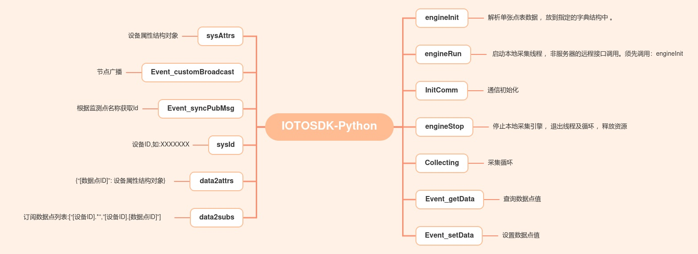

# IOTOSDK-Python


> 支持集群和单机部署；支持跨平台和多语言SDK；支持同步回调；功能兼具采集平台、通信中台、数据中台

#### 产品介绍
    IOTOS Python版本SDK，自带原生接口和采集引擎
* 驱动套件包含采集引擎和驱动，其中采集引擎由ZMIotLib库和iotosEngine进程构成；驱动则包含驱动类IOTOSDriverI，和用户基于此开发的扩展包。
* iotosEngine进程是整个采集引擎的启动入口，负责与平台通讯以及动态实例化加载驱动。用户进行设备对接、系统集成、服务扩展，只需要在驱动类基础上，开发扩展包即可，开发时配合WEB控制台进行设备建模、数据点表配置。

### 产品使用文档
* 开发使用入门介绍[http://docs.aiotos.net/docs/iotos/iotos-1db95bnmleg6f](http://docs.aiotos.net/docs/iotos/iotos-1db95bnmleg6f)
* 开发使用接口手册文档[http://docs.aiotos.net/docs/iotos/iotos-1db95c6h4k2ee](http://docs.aiotos.net/docs/iotos/iotos-1db95c6h4k2ee)
* WEB控制台的使用[http://docs.aiotos.net/docs/iotos/iotos-1db958kji7ki5](http://docs.aiotos.net/docs/iotos/iotos-1db958kji7ki5)
* 设备驱动代码示例[http://docs.aiotos.net/docs/iotos/iotos-1db95el2hk8ij](http://docs.aiotos.net/docs/iotos/iotos-1db95el2hk8ij)
* 驱动开发常见问题[http://docs.aiotos.net/docs/iotos/iotos-1dbo0c8komrfo](http://docs.aiotos.net/docs/iotos/iotos-1dbo0c8komrfo)


#### 软件架构


#### 环境
	版本兼容 Python2 和 Python3 

#### 安装教程

1.  Fork本仓库
2.  下拉Fork仓库中的代码到本地
3.  配置Python环境，安装需要的模块[requirements.txt](requirements.txt)


#### 使用说明
每个子项目都可以单独运行，需要事先在WEB控制台台中创建对应的设备,设备实例,通信网关,数据点。方可将采集到的数据传输到WEB控制台
1.  在WEB控制台[http://sys.aiotos.net/](http://sys.aiotos.net/)配置好设备,设备实例,通信网关,数据点
2.  根据开发文档[http://docs.aiotos.net/docs/iotos/iotos-1db95el2hk8ij](http://docs.aiotos.net/docs/iotos/iotos-1db95el2hk8ij)编写SDK驱动。
3.  运行使用后即可将数据丢到WEB控制台


---

### 通用返回格式
```
{
    "code": 0,      //0表示调用成功；非0则标识异常，具体见"错误码定义"

    "msg" ："ok",	//code为0时，为描述信息；非0则对应错误码定义中的英文内容
    
    "data"：null,	//code为0时，由具体业务接口返回数据而定，接口无返回则data为null，有返回则data为数据的字符串格式；
                    //code不为0时，通常存放程序捕获的异常信息字符串
}
```
### 错误码定义
#### 数值范围对应错误源
```
   0~99：   通信路由返回
100~499：	数据后台返回
500~999：	采集引擎返回
```
#### 错误码详细参照表

| 错误码 | Enum定义(data) | 中文描述 | 错误信息返回(msg) |
| ---- | ---- | ---- | ---- |
| 0 | Sucess | 没有错误（返回成功） | Success |
| 101 | Unknown | 未知失败 | Unknow error（当内部调用第三方库返回错误时，将库的反馈错误信息原样返回） |
| 2 | SelfOffline | 自己掉线 | self offline! |
| 3 | ObjectOffline | 网络错误 | Network error |
| 504 | NetError | 没有错误（返回成功） | Success |
| 105 | ArgError | 参数错误 | Argument error |
| 105 | ArgError | 参数错误 | Argument error |
|6	| NoWebSer | 没有WEB服务接入 | No webserver online!|
| 107 | AccountNotRegister | 用户名或密码错误，或登录失效 | Account invalid |
| 108 |	IONodeNotExist | 接入网关不存在 | Object not exists |
| 109 | DeviceNotExist | 设备不存在 | Device not exits |
| 110 | DataNotExist | 数据点不存在 | Data not exists |
| 111 |	PointNotExist |	点不存在 | Point not exists |
| 112 | ObjectNotAuth |	对象没有授权，目前指没有订阅相关接入网关 | Object has no authority |
|513 |	FileNotExist| 文件不存在 | File not exists |
| 514 |	TableNotValid | 点表格式不正确 | Table format invalid |
| 515 | PropertyNotValid | 属性非法操作 | Property access invalid |
| 516 | TypeNotValid | 监测点类型不匹配 | Point type mismatching |
| 517 |	RuleNotRecognized | 监测点条件规则未识别 | Table format not
recognized |
| 518 | ThreadNotDestoryed | 采集线程创建失败，存在未释放的 | Inner resource not released |
| 519 |	Timeout | 接口请求超时 | Timeout |
| 1000 |Reserved | 以内的系统保留，大于的为用户服务自定义码| user customed|	

